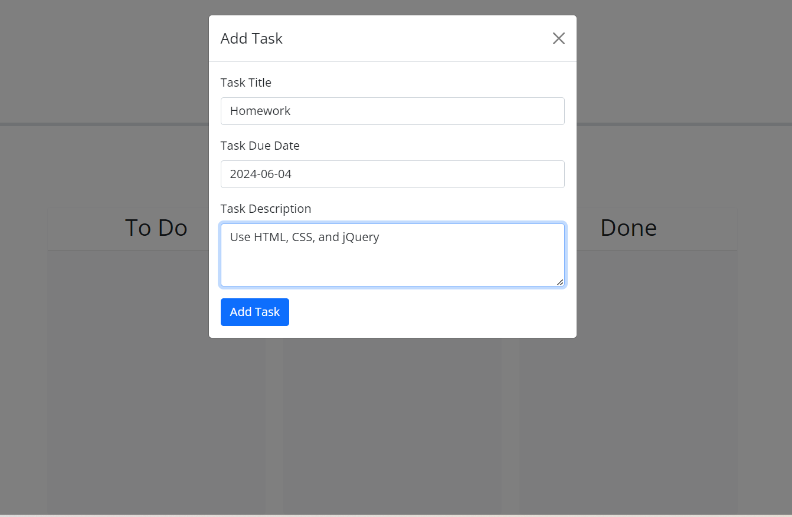
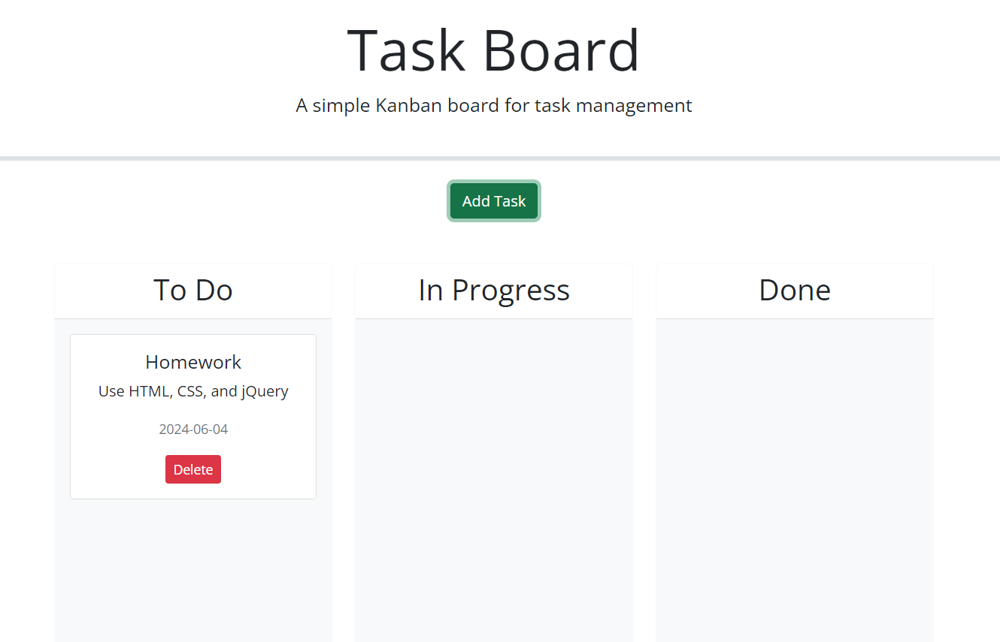

# Task Board
This project is a task board application for managing project tasks and tracking their progress. It features dynamic HTML and CSS, jQuery UI for interactivity, and Day.js for date handling. Users can add, update, and delete tasks with state persistence using localStorage.  

   
  
  
   

# Live at: 
https://ellafsd.github.io/task-board/   

## Technologies Used
 HTML  
 CSS  
 jQuery  